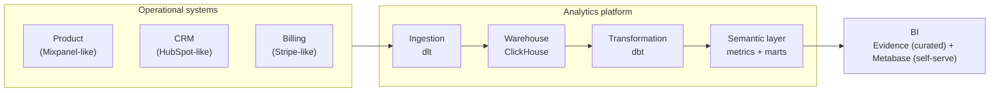

# Product Analytics Platform

**An end-to-end analytics engineering solution** for a B2B SaaS business — from
operational source systems to a trusted analytical model that answers the
questions product and commercial teams actually ask.

---

## TL;DR

| | |
|---|---|
| **What it is** | A complete analytics stack: source systems → ingestion → warehouse → transformation → semantic layer → BI |
| **What it proves** | I can take a business question, trace it to source data, and deliver a *trusted* answer — handling real-world messiness (late/duplicate events, 3 identity namespaces, mutable CRM, schema drift) along the way |
| **Stack** | Python · FastAPI · PostgreSQL · dlt · ClickHouse · dbt · Airflow · Evidence · Metabase |
| **Verification** | 25 dbt models + 84 data tests, **109/109 passing** |
| **One-liner** | `docker compose up` → a working analytics platform with a live BI dashboard |

---

## The problem

A B2B SaaS business runs on several operational systems — the product, the CRM,
billing — each with its **own data, own identifiers, and own imperfections**.
Answering *"where do customers drop during onboarding?"* or *"which accounts are
about to churn?"* means joining behaviour across those systems into a single
trusted model.

There is no universal ID. Data arrives late, duplicated, and in inconsistent
formats. The value of analytics engineering is turning that into something the
business can confidently act on.

## What I built

An end-to-end pipeline with a **clear separation of concerns**:



The operational system and the analytics system are deliberately **separate** —
just like a real company, where the analytics team doesn't own the product or
the CRM, it consumes their data.

The BI layer is split the way real teams split it: an **Evidence** report for
curated, version-controlled narrative (this repo), and a **Metabase** dashboard
for self-serve exploration by business users (build guide in
[`docs/engineering/metabase-dashboard.md`](docs/engineering/metabase-dashboard.md)).
Both consume the same mart tables and the same metric definitions.

## The five questions it answers

Every question is answered by a defined metric, traced to source data, and
visible in the BI layer:

1. **Activation** — where do users drop during onboarding, and how fast do they activate?
2. **Adoption** — which features are adopted, and what do user journeys look like?
3. **Conversion** — do activated users convert to paid, and how does behaviour relate to conversion?
4. **Retention** — how does retention vary by cohort and by activation?
5. **Churn & expansion** — what precedes churn, and which accounts expand?

## Results

| Metric | Value |
|--------|-------|
| Activation rate | ~71% |
| Onboarding funnel | 1,849 signups → 1,306 activated (progressive per-step drop-off) |
| Paid conversion | ~26% overall (activated ≈ 5× non-activated) |
| DAU/WAU stickiness | ~56% blended, ~70% on weekdays (B2B work-week rhythm) |
| Retention | ~54% at week 1, ~52% at week 4, ~47% at week 12 |
| Feature adoption | tasks ~94%, integrations ~65%, comments ~65% |
| Latest MRR | ~$55.8k across paying accounts |

*Numbers are computed live from the marts — the narrative in the BI report
updates with the data.*

---

## Why this demonstrates analytics engineering

Real operational data is messy. This project reproduces those problems
**deliberately**, and each has a test proving the analytical treatment:

| Problem | Why it occurs | Treatment |
|---------|---------------|-----------|
| Late events | ingestion delay | separate event vs ingestion timestamps |
| Duplicate events | delivery retries | event-level deduplication |
| Mutable CRM records | records change over time | merge (upsert) handling |
| Missing associations | systems update asynchronously | identity resolution |
| Future-effective records | scheduled changes | effective-date logic |
| Inconsistent labels | different source conventions | standardisation |
| Schema evolution | source schema changes | coalescing in staging |

That's the core discipline: **metrics are defined once, traceable to source,
and tested** — not reverse-engineered from a dashboard.

## The mindset behind it

I designed the solution **from the business down, not the technology up**:

```
Business context → Business questions → Metrics & semantics
        → Source systems → Data architecture → Ingestion & transformation
        → Data quality → BI
```

Technology was chosen *after* the architecture, not before it. The result is a
system where each layer has a single responsibility and a clear owner.

---

## Where the source data comes from

To make the platform exercise the same problems a real analytics team faces,
the source systems were modelled after **Mixpanel (product events), HubSpot
(CRM), and Stripe (billing)** — their identifiers, update semantics, and
failure modes were researched first, then reproduced faithfully. This is an
implementation detail, not the subject of the project: the subject is the
analytics engineering that turns that data into trusted answers. See
[`docs/simulation/`](docs/simulation/) for the source-system design.

---

## Where to go next

| You want to… | Go to |
|--------------|-------|
| See the full documentation, organised by audience | [`docs/README.md`](docs/README.md) |
| Understand the business context and questions | [`docs/business/`](docs/business/) |
| Understand the analytical model and metrics (BI-user reference) | [`docs/analytics/`](docs/analytics/) |
| Understand how it's built (developers) | [`docs/engineering/`](docs/engineering/) |
| Understand the source-system design | [`docs/simulation/`](docs/simulation/) |
| Build the self-serve Metabase dashboard | [`docs/engineering/metabase-dashboard.md`](docs/engineering/metabase-dashboard.md) |
| Run it yourself | [`docs/engineering/getting-started.md`](docs/engineering/getting-started.md) |

## Quick start (60 seconds)

```powershell
# 1. Build + start the stack
docker compose build
docker compose up -d postgres clickhouse api

# 2. Seed the source systems, ingest, transform
docker compose exec clickhouse clickhouse-client --query "CREATE DATABASE IF NOT EXISTS bronze; CREATE DATABASE IF NOT EXISTS staging; CREATE DATABASE IF NOT EXISTS core; CREATE DATABASE IF NOT EXISTS marts"
docker compose run --rm api alembic upgrade head
docker compose run --rm api python -m app.sim history --days 720
docker compose run --rm dlt python -m pipelines.ingest
docker compose run --rm dbt build          # 109/109 passing

# 3. Open the curated report
#    (Metabase self-serve dashboard: see docs/engineering/metabase-dashboard.md)
docker compose up -d evidence              # → http://localhost:3000
```

Full developer instructions (Airflow, daily advance, shortcuts) live in
[`docs/engineering/getting-started.md`](docs/engineering/getting-started.md).

---

## Technology

Python · FastAPI · PostgreSQL · dlt · ClickHouse · dbt · Airflow · Evidence · Metabase · Docker Compose
