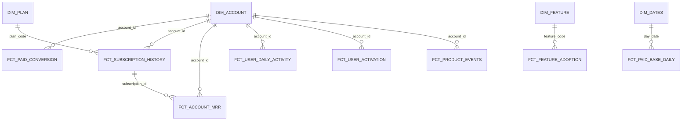

# Semantic Model

The semantic model is the contract between the marts and the BI layer. It
defines the **entities** (dimensions), **events/facts** (measures), and their
relationships, so a dashboard developer can answer the business questions
without touching raw source tables.

## Core entities (dimensions)

Materialised as `dim_*` tables in the marts. Facts reference them by natural
key; dimension attributes are joined at query time (star schema), not
re-embedded into every fact.

| Entity | Table | Natural key | Slow-changing? | Source(s) |
|--------|-------|-------------|----------------|-----------|
| Account | `dim_accounts` | `account_id` | SCD-current (plan/industry/country) | product + CRM + billing |
| Plan | `dim_plans` | `price_id` / `plan_code` | no (catalog) | billing |
| Feature | `dim_features` | `feature_code` | static | product (derived) |
| Date | `dim_dates` | `day_date` | no (calendar) | derived |
| User | `user_id` | — | (not materialised; only as event attribute) | product |
| Workspace | `workspace_id` | — | no | product |
| Project | `project_id` | — | no | product |
| Subscription | `subscription_id` | — | append-only history | billing |

`User`, `Workspace`, `Project`, and `Subscription` are not materialised as
separate dimension tables: their descriptive attributes live on the fact rows
that already carry them, and they are referenced by key. They remain first-class
entities in the model; only dimensions that *add descriptive attributes to
multiple facts* (account, plan, feature, date) are worth a physical table.

## Identity resolution

The three source systems use different identifiers for the same account. The
canonical identity model (`int_identity_mapping`) links:

```
product  account_id   ──┐
CRM      company_id   ──┼──►  canonical account key
billing  customer_id  ──┘
```

Rules, ownership, unknown identities, and missing associations are documented
in `../engineering/identity_resolution.md`.

## Measures (facts)

Measures live in fact tables with a single, documented grain:

| Fact | Grain | Key measures |
|------|-------|--------------|
| `fct_product_events` | one row per event | event count (1), distinct users |
| `fct_user_daily_activity` | user × day | is_active, event count |
| `fct_user_activation` | account | activated flag, time_to_activation |
| `fct_user_journey` | account | reached flags per milestone |
| `fct_feature_adoption` | feature × week | adoption rate |
| `fct_subscription_history` | subscription × effective period | status, seats |
| `fct_account_mrr` | account × month | mrr, expansion_mrr |
| `fct_paid_conversion` | account | is_converted |
| `fct_paid_base_daily` | day | cum_converted, cum_churned, paid_accounts |
| `fct_retention` | cohort × week offset | retained flag, retention rate |
| `fct_churn` | month | churned accounts, churn rate |
| `fct_usage_expansion` | account × month | total events, mrr, is_expanding |

## Relationships



## Time semantics

Every fact carries three distinct timestamps where applicable, and marts are
explicit about which one a measure uses:

- `event_at` — when the business thing happened (metric attribution).
- `effective_at` — when a state (plan, seat count) becomes true (SCD / MRR).
- `ingested_at` — when the row reached the warehouse (diagnostics only).

## Grain rule

Every mart model declares its grain in a header comment and enforces it with a
`unique` test on the grain key. No mart mixes grains silently.
