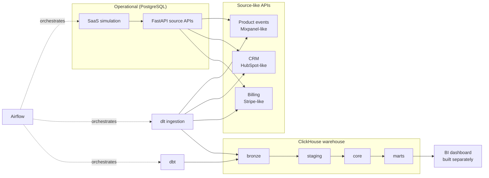

# Architecture

The SaaS Product Analytics Platform demonstrates the complete chain:

```text
REALISTIC BUSINESS
      ↓
REALISTIC SOURCE SYSTEMS
      ↓
REALISTIC DATA PROBLEMS
      ↓
INGESTION
      ↓
WAREHOUSE
      ↓
TRANSFORMATION
      ↓
SEMANTIC MODEL
      ↓
BI
```

## System diagram



## Layer responsibilities

| Layer | Store | Owner | Responsibility |
|-------|-------|-------|----------------|
| Operational | PostgreSQL | `api` / `sim` | Business state: accounts, users, events, CRM, billing |
| Source APIs | FastAPI | `api` | Mixpanel/HubSpot/Stripe-like read APIs (pagination, updated_since) |
| Bronze | ClickHouse `bronze` | `dlt` | Raw, source-aligned data; preserves duplicates + timestamps |
| Staging | ClickHouse `staging` | `dbt` | Type casting, standardisation, dedup, SCD-current |
| Core | ClickHouse `core` | `dbt` | Reusable business logic (identity, activation, subscriptions) |
| Marts | ClickHouse `marts` | `dbt` | Business-facing facts/dims/aggregates with documented grains |
| Orchestration | Airflow | `airflow` | Ordering, schedule, retries only - no business logic |

## Key design decisions

See `decisions/architecture-decisions.md` for the full ADR set. Summary:

1. **Canonical identity** is the product `account_id`; CRM (`company_id`) and
   billing (`customer_id`) map via `account_ref`. No universal ID.
2. **Three timestamps** never conflated: `event_at` (business), `effective_at`/
   `recorded_at` (state change), `source_updated_at` (ingestion cursor).
3. **Append-only + merge** ingestion: events append (dedup in dbt), mutable
   records merge (upsert by source PK) - idempotent reruns.
4. **Deterministic simulation**: per-day seed `f(SEED, day_index)`; history is
   reproducible and append-only.
5. **Medallion in ClickHouse**: bronze (dlt) → staging → core → marts (dbt).
6. **9 deliberate data-quality scenarios** baked in and each covered by a test.

## Ports & services

| Service | Port | Purpose |
|---------|------|---------|
| postgres | - (internal) | Operational source-of-truth |
| api | - (internal) | Source APIs + simulation CLI |
| clickhouse | - (internal) | Analytical warehouse |
| dbt | 8083 (docs serve) | Transformation (run on demand) |
| dlt | - (internal) | Ingestion (run on demand) |
| airflow | - (internal) | Orchestration (runs by default; webserver not exposed) |
